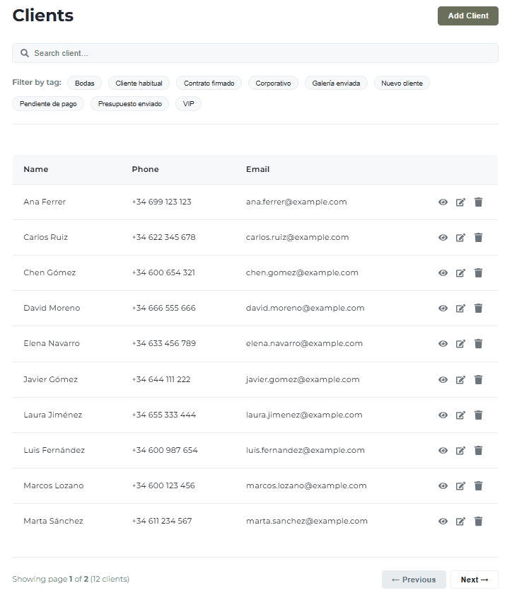

# Galerium FullStack

A full-stack CRUD application designed for photographers to manage clients, galleries, and sessions. This project was developed as the final project for Module 3 of the IronHack Web Development Bootcamp.

## ✨ Key Features

This application was built with a strong focus on a clean user experience and a robust, scalable architecture.

* **Full Client Management:** Complete CRUD functionality (Create, Read, Update, Delete) for client records.
* **Dynamic Data Handling:**
    * Server-side pagination and sorting for efficient data management.
    * Debounced text search across multiple client fields (name, email, phone).
    * Intuitive, multi-select tag filtering to easily segment clients.
* **Advanced User Experience (UX):**
    * **User-Centric Feedback:** The UI provides constant feedback with flicker-free loading states, clear error messages on API failures, and "no results" notifications.
    * **Advanced Tag System:** The client form features a tag input with autocomplete, suggesting existing tags to ensure data consistency while still allowing the creation of new ones on the fly.
    * **Interactive Modals:** Confirmation modals for destructive actions (like deleting) are user-friendly, featuring smooth animations and the ability to close by clicking outside.
    * **Image Previews:** The client form provides an instant preview for image URLs, with elegant error handling for broken links.
* **Consistent Design System:** A unified styling guide with CSS variables ensures a consistent and professional look and feel across all components.

## 📸 Screenshots

<p align="center">
  <em>Client list with search, multi-tag filtering, and pagination.</em>
  <br>
  
</p>

<p align="center">
  <em>Smart form with real-time validation and tag autocomplete with keyboard navigation.</em>
  <br>
  
</p>`

---

## 🛠️ Tech Stack

| Area       | Technologies                                              |
| :--------- | :-------------------------------------------------------- |
| **Frontend** | React, Vite, React Router,  `react-hot-toast`           |
| **Backend** | Java, Spring Boot, Spring Data JPA, Spring Security   |
| **Database** | MySQL (Production), H2 (Development)                      |
| **Testing** | JUnit 5, Mockito (Backend), Vitest, RTL (Frontend)        |
| **Tooling** | Maven, Node.js, ESLint, Prettier                          |

---

## 🚀 Getting Started Locally

### Prerequisites

* Java 17+
* Node.js 18+
* Maven 3+
* Git

### 1. Backend Setup

```bash
# Clone the repository
git clone https://github.com/AidaG91/Galerium-FullStack.git
cd galerium-fullstack/backend

# Install dependencies and build the project
mvn clean install

# Run the Spring Boot application
mvn spring-boot:run

# The backend will be available at http://localhost:8080
# You can check the health status at: http://localhost:8080/api/health
```

### 2. Frontend Setup
```bash
# In a new terminal, navigate to the frontend directory
cd ../frontend

# Install dependencies
npm install

# Create the local environment file
cp .env.example .env

# Run the development server
npm run dev

# The application will be available at http://localhost:5173
```

## Configuration
The project uses configuration files for both the backend and frontend.

### Backend (backend/src/main/resources/application.properties)
For development, the application uses an in-memory H2 database. For production, you should configure the connection to a MySQL database and set the ddl-auto property to update.

```properties
# Development (H2)
spring.jpa.hibernate.ddl-auto=create-drop
spring.datasource.url=jdbc:h2:mem:galeriumdb
spring.datasource.driverClassName=org.h2.Driver
spring.datasource.username=sa
spring.datasource.password=

# Production (MySQL Example)
# spring.jpa.hibernate.ddl-auto=update
# spring.datasource.url=jdbc:mysql://localhost:3306/galerium
# spring.datasource.username=root
# spring.datasource.password=yourpassword
```

### Frontend (frontend/.env)
The frontend needs to know the base URL of the backend API. Copy this file to .env for local development.

```dotenv 
VITE_API_URL=http://localhost:8080/api
```

## 📚 API Endpoints

The core API for the `Client` resource follows RESTful conventions.

| Method   | Endpoint                      | Description                                |
| :------- | :---------------------------- | :----------------------------------------- |
| `GET`    | `/api/health`                 | Checks the database connection status.     |
| `GET`    | `/api/tags`                   | Retrieves a list of all unique tags.       |
| `GET`    | `/api/clients/paged`          | Lists clients with pagination and sorting. |
| `GET`    | `/api/clients/search/paged`   | Searches clients by text query.            |
| `GET`    | `/api/clients/by-tag`         | Filters clients by one or more tags.       |
| `POST`   | `/api/clients`                | Creates a new client.                      |
| `GET`    | `/api/clients/{id}`           | Retrieves a single client by ID.           |
| `PUT`    | `/api/clients/{id}`           | Updates an existing client.                |
| `DELETE` | `/api/clients/{id}`           | Deletes a client.                          |

---

## 🧪 Testing

The project includes tests for both the backend and frontend to ensure code quality and reliability.

### Backend Tests

The backend includes both **Unit tests** for the controller layer (`@WebMvcTest`) and a full **Integration test** (`@SpringBootTest`) that validates the complete CRUD lifecycle against a test database.

```bash
# From the /backend directory
mvn test
```

### Frontend Tests
The frontend uses Vitest and React Testing Library to test critical components. The tests cover rendering the client list from a mocked API and verifying the "no results" state.

```bash
# From the /frontend directory
npm test
```

---
## 🛠️ Development Tooling & Quality Assurance

This project is configured with modern tools to ensure code quality, consistency, and a productive development experience. All dependencies are included in the respective `package.json` and `pom.xml` files.

* **ESLint:** Used for static code analysis to find and fix problems in the JavaScript/React code. The configuration is based on the modern "flat config" (`eslint.config.js`).
* **Prettier:** Integrated for automated code formatting, ensuring a consistent style across the entire codebase.
* **Vitest & React Testing Library:** A modern testing framework is set up for the frontend, allowing for fast and reliable component testing in a simulated DOM environment (`jsdom`).

---

## 🏗️ Architectural Decisions

### Frontend Architecture

* **Scalable CSS with CSS Modules:** Prevents style conflicts and ensures components are self-contained.
* **Reusable Global Styles:** A base design system is established in `index.css`, including a centralized color palette with CSS variables and global utility classes for common elements like buttons (`.btn`, `.btn--primary`), promoting a DRY (Don't Repeat Yourself) codebase.
* **Centralized API Logic:** All `fetch` calls to the backend are managed in a dedicated service file (`src/api/clientService.js`), separating API communication logic from the UI components for better maintainability.

### Backend Architecture

* **Robust Entity Relationships (`@ManyToMany`):** For the `tags` feature, a `@ManyToMany` relationship between the `Client` and `Tag` entities was implemented. This architecture ensures data integrity, prevents tag duplication, and provides a scalable foundation for advanced filtering.
* **Service Layer Intelligence:** The logic for managing `tags` (finding existing ones or creating new ones) is centralized in the service layer (`ClientService`), keeping the controllers slim and focused on handling HTTP requests.
* **Data Seeding on Startup:** A `DataLoader` component uses `CommandLineRunner` to populate the database with realistic sample data on application startup, facilitating easy testing and development.

---
## 👤 Author & Project Owner
**Aïda García** - junior web dev
